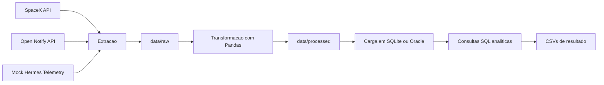
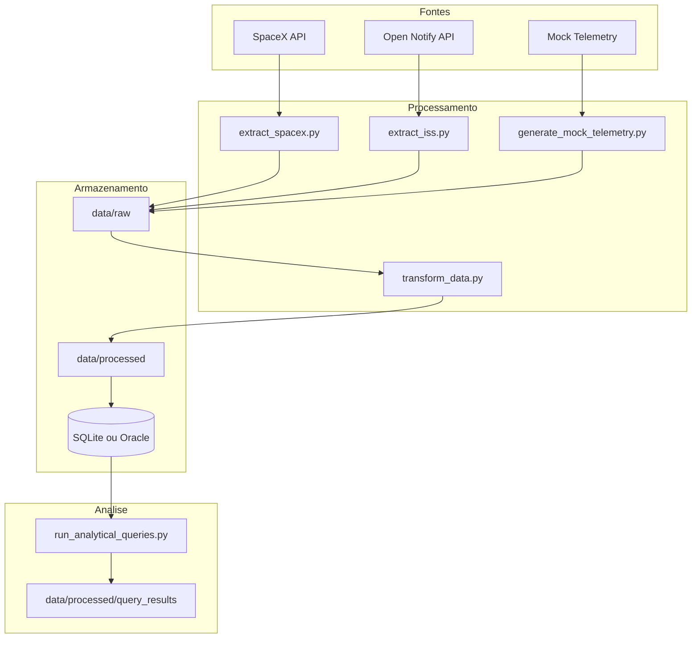
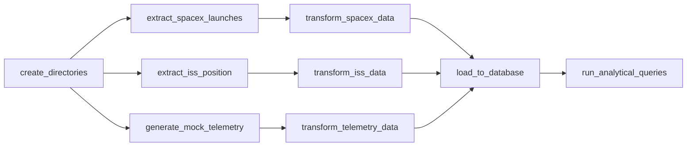
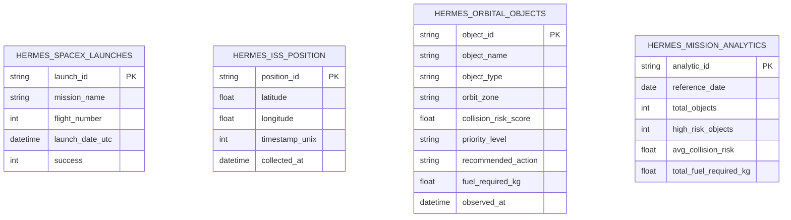

# Hermes Orbital Data Pipeline

Pipeline de dados desenvolvido para a Global Solution 2026 da FIAP no contexto do Projeto Hermes. A solucao automatiza a coleta, transformacao, carga e analise de dados orbitais usando Python, Pandas, SQL, SQLite/Oracle e Apache Airflow.

## Visao Geral

O projeto combina tres frentes:

- dados reais de lancamentos da SpaceX;
- dados reais da posicao atual da ISS;
- telemetria orbital simulada para o ecossistema Hermes.

O pipeline executa um fluxo ETL completo:



## Integrantes

| Nome | RM |
|---|---:|
| Aksel Viktor Caminha Rae | 99011 |
| Ian Xavier Kuraoka | 98860 |
| Lucas Laia Manentti | 97709 |
| Rony Ken Nagai | 551549 |
| Tomaz Versolato Carballo | 551417 |

## Objetivo

Construir uma esteira de dados orbital capaz de:

- extrair dados de APIs publicas;
- gerar telemetria simulada para objetos orbitais;
- padronizar e enriquecer os dados com regras de negocio;
- carregar os resultados em banco relacional;
- produzir consultas analiticas para apoiar decisoes do Projeto Hermes.

## Fontes de Dados

| Fonte | Tipo | Finalidade |
|---|---|---|
| `https://api.spacexdata.com/v4/launches` | API publica | Historico de lancamentos espaciais |
| `http://api.open-notify.org/iss-now.json` | API publica | Posicao atual da ISS |
| `data/mock/hermes_orbital_telemetry.csv` | CSV simulado | Telemetria orbital do ecossistema Hermes |

Se alguma API estiver indisponivel, os scripts usam fallback local em `data/mock/`.

## Arquitetura



## Orquestracao no Airflow

A DAG principal esta em `dags/hermes_orbital_pipeline_dag.py` e possui o id `hermes_orbital_pipeline`.



### Tarefas da DAG

| Task ID | Funcao |
|---|---|
| `create_directories` | Garante a existencia de `data/raw`, `data/processed` e `data/mock` |
| `extract_spacex_launches` | Baixa dados da SpaceX API ou usa fallback local |
| `extract_iss_position` | Baixa a posicao da ISS ou usa fallback local |
| `generate_mock_telemetry` | Gera telemetria orbital simulada |
| `transform_spacex_data` | Limpa e padroniza os dados de lancamentos |
| `transform_iss_data` | Limpa e padroniza os dados da ISS |
| `transform_telemetry_data` | Enriquecimento da telemetria com prioridade e acao recomendada |
| `load_to_database` | Carrega os dados em Oracle ou SQLite, conforme `HERMES_DB_TARGET` |
| `run_analytical_queries` | Executa as consultas analiticas e exporta resultados em CSV |

## Estrutura do Projeto

```text
hermes-orbital-data-pipeline/
|-- airflow_home/
|-- dags/
|   `-- hermes_orbital_pipeline_dag.py
|-- data/
|   |-- mock/
|   `-- raw/
|-- scripts/
|   |-- config.py
|   |-- extract_iss.py
|   |-- extract_spacex.py
|   |-- generate_mock_telemetry.py
|   |-- load_database.py
|   |-- load_oracle.py
|   |-- load_sqlite.py
|   |-- run_analytical_queries.py
|   `-- transform_data.py
|-- sql/
|   |-- 01_create_tables_oracle.sql
|   |-- 02_create_tables_sqlite.sql
|   |-- 03_analytical_queries_oracle.sql
|   `-- 04_analytical_queries_sqlite.sql
|-- .env.example
|-- docker-compose.yml
|-- README.md
`-- requirements.txt
```

Observacao: `data/processed/` e `data/processed/query_results/` sao criados durante a execucao do pipeline.

## Regras de Transformacao

As transformacoes principais acontecem em `scripts/transform_data.py` e incluem:

- validacao de arquivos obrigatorios;
- remocao de registros invalidos;
- remocao de duplicidades por chave primaria logica;
- conversao de datas para formato padronizado;
- coercao de colunas numericas;
- criacao de `priority_level`;
- criacao de `recommended_action`;
- geracao de `mission_analytics.csv`.

### Prioridade de risco

| `collision_risk_score` | `priority_level` |
|---|---|
| `>= 80` | `CRITICAL` |
| `>= 60` e `< 80` | `HIGH` |
| `>= 40` e `< 60` | `MEDIUM` |
| `< 40` | `LOW` |

### Acao recomendada

| Regra | `recommended_action` |
|---|---|
| prioridade `CRITICAL` | `IMMEDIATE_DEORBIT` |
| prioridade `HIGH` | `SCHEDULE_CAPTURE` |
| prioridade `MEDIUM` e `object_type = ACTIVE_SATELLITE` | `ORBITAL_TAXI` |
| prioridade `MEDIUM` para os demais objetos | `MONITOR` |
| prioridade `LOW` | `NO_ACTION` |

## Modelo de Dados

O projeto cria quatro tabelas principais:

| Tabela | Descricao |
|---|---|
| `HERMES_SPACEX_LAUNCHES` | Lancamentos obtidos da SpaceX |
| `HERMES_ISS_POSITION` | Posicoes coletadas da ISS |
| `HERMES_ORBITAL_OBJECTS` | Telemetria tratada dos objetos orbitais |
| `HERMES_MISSION_ANALYTICS` | Agregacoes consolidadas da execucao |

### Relacao entre entidades



## Requisitos

- Python 3.10 ou superior
- Docker Desktop
- PowerShell ou terminal equivalente
- acesso a internet para consumo das APIs
- credenciais Oracle para a execucao padrao do projeto

## Configuracao

Na pasta do projeto:

```powershell
cd hermes-orbital-data-pipeline
copy .env.example .env
```

Conteudo esperado do `.env`:

```env
AIRFLOW_UID=50000
HERMES_DB_TARGET=oracle
ORACLE_USER=
ORACLE_PASSWORD=
ORACLE_HOST=oracle.fiap.com.br
ORACLE_PORT=1521
ORACLE_SID=ORCL
```

### Banco alvo

- `oracle`: configuracao padrao do projeto via `.env.example`
- `sqlite`: alternativa local para demonstracao ou contingencia

## Execucao Manual

```powershell
python -m venv .venv
.venv\Scripts\Activate.ps1
pip install -r requirements.txt
copy .env.example .env
python scripts\extract_spacex.py
python scripts\extract_iss.py
python scripts\generate_mock_telemetry.py
python scripts\transform_data.py
python scripts\load_database.py
python scripts\run_analytical_queries.py
```

### Artefatos gerados

- `data/raw/spacex_launches.json`
- `data/raw/iss_position.json`
- `data/raw/hermes_orbital_telemetry.csv`
- `data/processed/spacex_launches.csv`
- `data/processed/iss_position.csv`
- `data/processed/orbital_objects.csv`
- `data/processed/mission_analytics.csv`
- `data/processed/query_results/*.csv`
- `hermes_orbital.db` quando o fallback SQLite for acionado

## Execucao com Airflow e Docker

```powershell
copy .env.example .env
docker compose up airflow-init
docker compose up
```

A interface do Airflow fica em `http://localhost:8080`.

Observacao: para usar Oracle como padrao, mantenha `HERMES_DB_TARGET=oracle`. Se houver indisponibilidade de acesso ao Oracle no ambiente da apresentacao, altere para `sqlite` antes de rodar a DAG.

Credenciais padrao:

- usuario: `admin`
- senha: `admin`

Passos no Airflow:

1. localizar a DAG `hermes_orbital_pipeline`;
2. ativar a DAG;
3. executar `Trigger DAG`;
4. acompanhar `Grid View`, `Graph View` e logs.

Para encerrar:

```powershell
docker compose down
```

Para recriar o ambiente do zero:

```powershell
docker compose down -v
```

## Consultas Analiticas

As queries ficam em:

- `sql/03_analytical_queries_oracle.sql`
- `sql/04_analytical_queries_sqlite.sql`

Consultas implementadas:

1. quantidade de objetos orbitais por tipo;
2. media, minimo e maximo do risco de colisao por zona orbital;
3. top 10 objetos com maior risco de colisao;
4. quantidade de missoes por acao recomendada;
5. combustivel total por nivel de prioridade;
6. lancamentos SpaceX bem-sucedidos e malsucedidos por ano;
7. ultimas posicoes registradas da ISS.

Exemplo:

```sql
SELECT object_type, COUNT(*) AS total_objects
FROM HERMES_ORBITAL_OBJECTS
GROUP BY object_type
ORDER BY total_objects DESC;
```

## Como Usar no Relatorio

Se a equipe quiser deixar o PDF mais consistente com o codigo, estas secoes devem aparecer explicitamente:

- contexto e objetivo do Projeto Hermes;
- arquitetura do pipeline;
- explicacao da DAG e suas dependencias;
- fontes de dados reais e mockadas;
- regras de transformacao e priorizacao de risco;
- modelagem das tabelas;
- evidencias de execucao no Airflow;
- evidencias do banco carregado;
- resultados das consultas SQL;
- conclusao tecnica.

### Prints recomendados

1. estrutura do projeto no editor;
2. DAG em `dags/hermes_orbital_pipeline_dag.py`;
3. `docker compose up` em execucao;
4. tela inicial do Airflow;
5. `Graph View` da DAG;
6. `Grid View` com tarefas verdes;
7. logs de extracao;
8. logs de transformacao;
9. logs de carga;
10. logs de consultas analiticas;
11. pasta `data/raw`;
12. pasta `data/processed`;
13. pasta `data/processed/query_results`;
14. tabelas populadas no SQLite ou Oracle;
15. resultado de pelo menos 5 consultas SQL.

## Solucao de Problemas

### A DAG nao aparece

```powershell
docker compose down
docker compose up
```

### Porta 8080 ocupada

Altere `docker-compose.yml`:

```yaml
ports:
  - "8081:8080"
```

Depois acesse `http://localhost:8081`.

### Erro no Oracle

Verifique `ORACLE_USER`, `ORACLE_PASSWORD`, conectividade com `oracle.fiap.com.br` e o valor de `HERMES_DB_TARGET`.

Para nao travar a demonstracao:

```env
HERMES_DB_TARGET=sqlite
```

### Erro de permissao no PowerShell

```powershell
Set-ExecutionPolicy -ExecutionPolicy RemoteSigned -Scope CurrentUser
```

## Entrega

Arquivos importantes para o ZIP complementar:

- `dags/`
- `scripts/`
- `sql/`
- `data/mock/`
- `README.md`
- `requirements.txt`
- `docker-compose.yml`
- `.env.example`

Arquivos que nao devem ser enviados:

- `.env`
- `.venv/`
- `__pycache__/`
- `*.db`
- `data/processed/`

## Conclusao

O Hermes Orbital Data Pipeline demonstra uma esteira completa de engenharia de dados aplicada ao dominio espacial. O projeto integra dados reais e simulados, aplica tratamento e enriquecimento com regras de negocio, carrega os dados em banco relacional e produz analises que ajudam a priorizar risco orbital, monitorar ativos e planejar operacoes do ecossistema Hermes.
